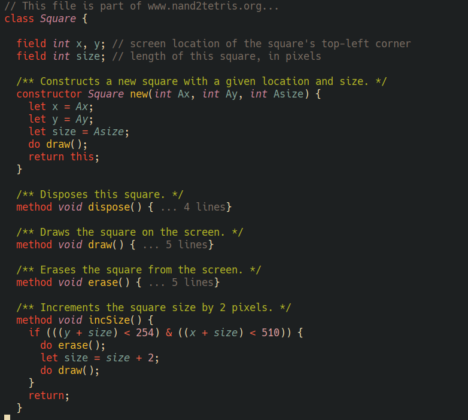

## jack-ts-mode - Emacs major mode for Jack language from nand2tetris

[](https://www.gnu.org/licenses/gpl-3.0)

A major mode for editing Jack programming language files. 

The Jack language  is developed as part of the
[Nand2Tetris]([nand2tetris.org](https://www.nand2tetris.org/)) coures (available
on Coursera [Nand to Tetris Part II](https://www.coursera.org/learn/nand2tetris2)).

This mode provides the following features for Jack source buffers:

  - font-locking
  - indentation
  - structural navigation with tree-sitter objects
  - imenu
  


For a major-mode without tree-sitter, see
[jack-mode](https://github.com/nverno/jack-mode).

## Installation

Emacs 29.1 or above with tree-sitter support is required. 

Tree-sitter starter guide: https://git.savannah.gnu.org/cgit/emacs.git/tree/admin/notes/tree-sitter/starter-guide?h=emacs-29

### Install tree-sitter parser for Jack

```elisp
(add-to-list
 'treesit-language-source-alist
 '(jack "https://github.com/nverno/tree-sitter-jack"))
(treesit-install-language-grammar 'jack)
```

### Install jack-ts-mode.el from source

- Clone this repository
- Add the following to your emacs config

```elisp
(require "[cloned nverno/jack-ts-mode]/jack-ts-mode.el")
```
